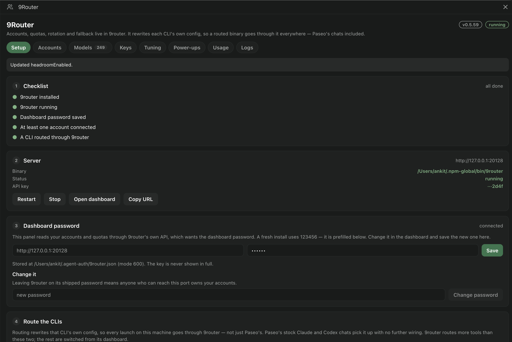
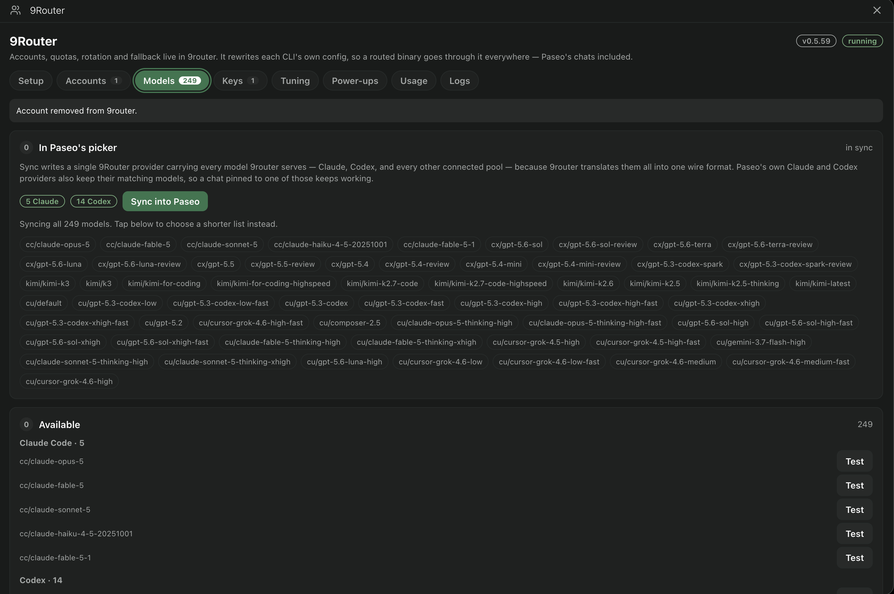
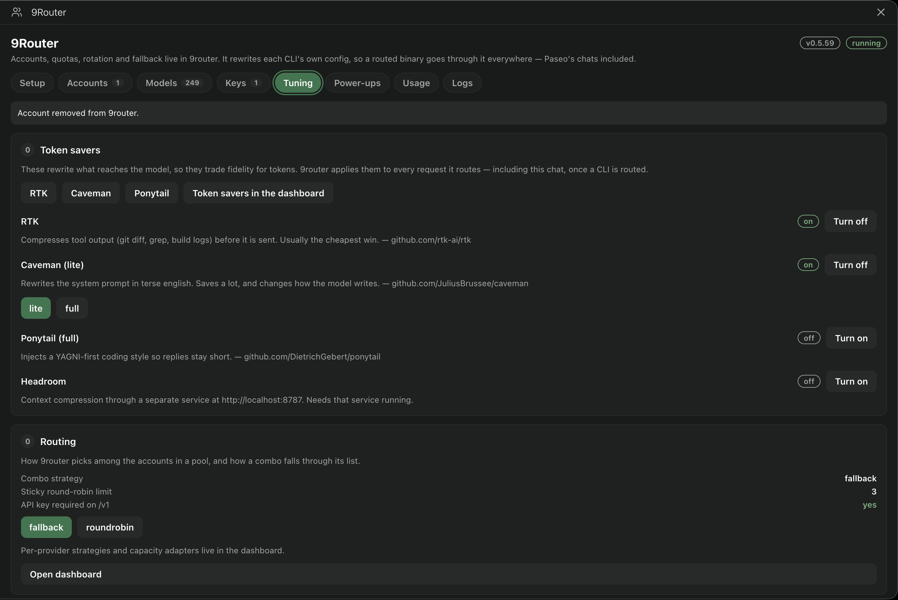

<div align="center">

# paseo-plugin-9router

**9router's accounts, quotas and models, wired into Paseo.**

[](https://github.com/itsjustanks/paseo-plugin-9router/releases/latest)
[](LICENSE)


</div>

[9router](https://github.com/decolua/9router) is a local proxy that holds your Claude Code, Codex and other subscriptions, tracks their quotas, and falls back between them when one runs out. It also rewrites each CLI's own config, so a routed `claude` or `codex` goes through it **everywhere** — Paseo's chats included.

This project is the Paseo half: a sidebar panel that sets 9router up, shows what it is doing, and lists its models where Paseo can see them. Plus a small CLI for the same jobs from a terminal.

**9router is a hard dependency.** Without it running, this does nothing.

## Install

```sh
npm install -g 9router          # the router itself
9router                         # dashboard at http://localhost:20128
```

Then the Paseo plugin:

```sh
paseo plugin add itsjustanks/paseo-plugin-9router --path apps/paseo --id agent-link
```

Open **9Router** in the Paseo sidebar and work down the Setup checklist. The dashboard password field is prefilled with 9router's first-run default (`123456`) — change it in the dashboard and save the new one here.

The CLI is optional:

```sh
mkdir -p ~/.local/bin
curl -fsSL https://raw.githubusercontent.com/itsjustanks/paseo-plugin-9router/main/agent-link -o ~/.local/bin/agent-link
chmod +x ~/.local/bin/agent-link
agent-link doctor
```

## The panel

<div align="center">
  
</div>

**Setup** is the checklist and the wizard at once — install, start, save the password, connect an account, route a CLI — with Restart and Stop beside Start, and the dashboard password prefilled with 9router's shipped default.

<div align="center">
  
</div>

**Accounts** shows each connection's quota windows and when they reset, and surfaces any account 9router has parked along with the error responsible — a hold outlives its cause, so clearing it is a button rather than a wait.

<div align="center">
  
</div>

**Models** writes a single 9Router provider carrying every model 9router serves, and can test any one of them with a real completion.

<div align="center">
  
</div>

**Tuning** switches the token savers, each linked to the project it came from, and shows how 9router picks among the accounts in a pool.

## How the routing actually works

There is no custom provider or ACP runtime. 9router edits the CLIs themselves:

| Routed CLI | What 9router writes | Effect |
| --- | --- | --- |
| Claude Code | `env` block in `~/.claude/settings.json` (`ANTHROPIC_BASE_URL`, `ANTHROPIC_AUTH_TOKEN`, `ANTHROPIC_DEFAULT_*_MODEL`) | every `claude` launch on the machine |
| Codex | `model_provider` + `[model_providers.9router]` in `~/.codex/config.toml` | every `codex` launch on the machine |

Paseo's stock Claude and Codex providers inherit this for free, because they run those same binaries. Turn it on per CLI in **Setup**, or:

```sh
agent-link route claude on
agent-link route codex off
```

This is machine-wide, not Paseo-only. The panel says so before you press it.

## Models

9router namespaces models by pool:

| Prefix | Pool |
| --- | --- |
| `cc/` | your Claude Code subscription accounts |
| `cx/` | your Codex accounts |
| `kimi/`, `cu/`, `gh/`, `glm/`… | other connected providers |
| combo name | an ordered fallback list that behaves like one model |

**Sync into Paseo** writes a single **9Router** provider carrying every model 9router serves, whatever pool it came from — 9router translates them all into one wire format, so one provider is enough. Paseo's own Claude and Codex providers also keep their matching models, so a chat already pinned to one of those keeps working.

The provider id is `ninerouter`, not `9router`: Paseo requires ids to match `/^[a-z][a-z0-9-]*$/`, and an id starting with a digit makes the whole config invalid.

### Exposing a model 9router does not know

9router ships a fixed catalogue, so a newly released model is invisible until you add it. In **Models → Expose a model**:

```
alias: cc     id: claude-fable-5-1     name: Claude Fable 5.1
```

### Aliases

An alias maps a plain model name onto a 9router model, so a tool that asks for `claude-opus-5` reaches the `cc/` pool. With one of these, Paseo's stock picker entries route through 9router without listing anything.

### Every tab

| Tab | What it holds |
| --- | --- |
| **Setup** | checklist, install command, server controls, dashboard password, per-CLI routing |
| **Accounts** | connections with quota bars, OAuth sign-in, parked accounts and how to revive them |
| **Models** | one 9Router provider, live reachability test, expose a model, aliases, combos |
| **Keys** | API keys and combos, full CRUD |
| **Tuning** | RTK, Caveman, Ponytail, Headroom; combo strategy and sticky round-robin |
| **Power-ups** | match 9router's client version to yours; update Claude Code |
| **Usage** | requests, tokens and equivalent API cost, by provider and by model |
| **Logs** | 9router's console, tailed every 4s |

The 9router dashboard **cannot be embedded**. Paseo plugin surfaces are React Native with no WebView, and the SDK has no browser-tab API. "Open dashboard" hands the URL to your system browser; ⌘⇧B opens a Paseo browser tab you can paste into.

## CLI

```
agent-link auto                       list 9router's models on Paseo's providers, clean up, reload
agent-link route claude|codex on|off  route that CLI through 9router, or restore it
agent-link status                     9router + Paseo wiring at a glance
agent-link 9router start|stop|status  run the local server
agent-link 9router key                reuse or mint an API key
agent-link app install|status|remove paseo [--link]
agent-link doctor                     prerequisites and wiring
```

Settings live in `~/.agent-link/9router.json` (or `~/.agent-auth/9router.json` on an older install), mode 600, holding `{url, apiKey, password}`. Override with `AGENT_LINK_9ROUTER_URL` / `AGENT_LINK_9ROUTER_KEY`. The key is never printed in full.

## Things that will bite you

**A parked account does not unpark itself.** 9router marks an account unavailable on *any* error — a quota limit and a malformed request get identical treatment — and only clears that state after a **successful request from that same account**. While parked it is excluded from selection, so it never gets one. Fix the cause, then clear the hold in **Accounts**; waiting only works once the backoff expires.

**Client version gates.** 9router sends its own hardcoded `claude-cli/<version>` User-Agent rather than yours. When Anthropic gates a new model behind a newer Claude Code, every account 400s with *"Claude Code X does not support this model"* until 9router ships a bump — and then parks them, per the above.

**Large MCP sets and small context windows.** If your global MCP config is bigger than a model's context window, that model 400s with *"prompt is too long"* through any path. The panel shows 9router's error verbatim rather than hiding it.

**Terms.** Routing a subscription sign-in through a local proxy is outside Anthropic's and OpenAI's consumer terms. Your call to make knowingly.

## License

MIT
