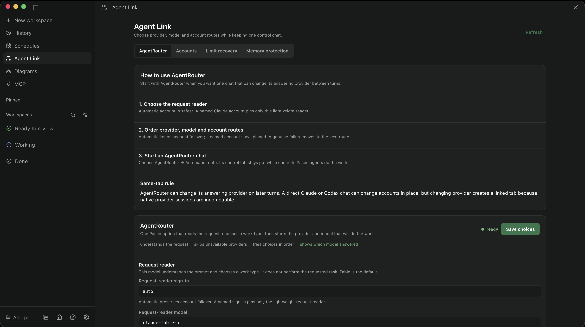
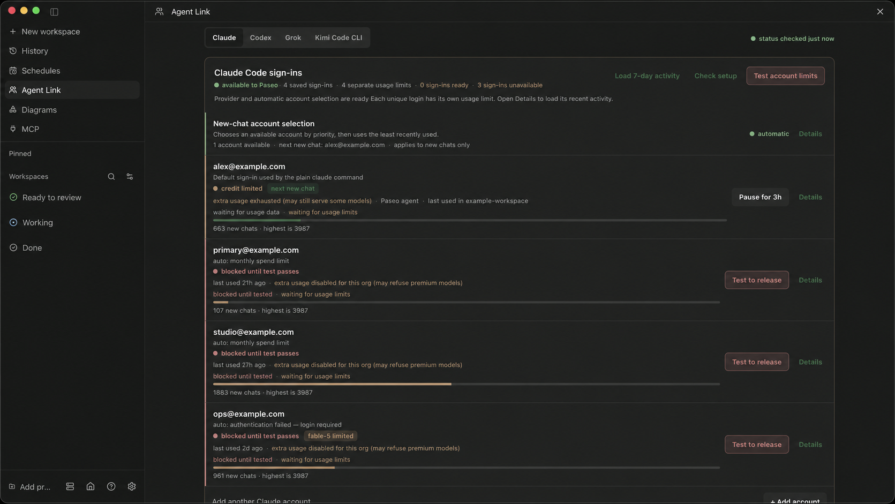
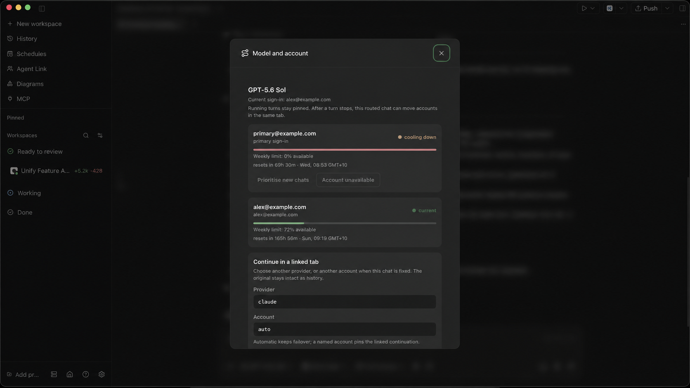

<div align="center">

# paseo-agent-link

**Account-aware routing, limit recovery, and memory protection for Paseo.**

[](https://github.com/itsjustanks/paseo-agent-link/releases/latest)
[](LICENSE)


</div>

**Agent Link** keeps several Claude Code and Codex accounts signed in at once, sends new work to a healthy account, and recovers chats after a usage limit. The product and Paseo plugin are called **Agent Link**; the CLI remains `agent-link`.

## Start here

Install the CLI:

```sh
mkdir -p ~/.local/bin
curl -fsSL https://raw.githubusercontent.com/itsjustanks/paseo-agent-link/main/agent-link -o ~/.local/bin/agent-link
chmod +x ~/.local/bin/agent-link
```

Add accounts and enable routing:

```sh
agent-link add claude you@work.com
agent-link add claude you@home.com
agent-link auto
agent-link status
```

Add the Paseo plugin:

```sh
agent-link app install paseo
```

Or let Paseo manage it directly from Git:

```sh
paseo plugin add itsjustanks/paseo-agent-link --path apps/paseo --id agent-link
```

## What it does

| Need | Agent Link behaviour |
| --- | --- |
| Use several accounts | Each login gets its own native config directory; no token copying or credential swapping |
| Avoid exhausted accounts | New agents use a healthy account by priority and least-recent use |
| Preserve running work | A live process keeps the account it started with |
| Recover a limited chat | The account is parked and the transcript resumes on an eligible account |
| See real capacity | Usage, reset times, holds, attempts, and account identity appear together |
| Protect the host | Heavy Paseo type-checks pause under memory pressure and continue after recovery |

Routing happens **when an agent starts**. Agent Link never changes credentials underneath a running process.

## In Paseo

### Route work across providers



AgentRouter reads the request, then delegates to ordered provider, model, and account routes. It coordinates the work; a concrete Paseo child agent produces each answer.

### See capacity by account



Accounts combine login state, usage evidence, model access, last use, priority, and recovery controls. **Limit recovery** records refusals and holds only the affected account or model. **Memory protection** pauses heavy compiler jobs when the Mac is under pressure.

### Change model or account from a chat



Every routed Claude or Codex chat gets a **model and account** composer pill. It shows the active provider, model, account, limits, and recovery state. A stopped chat can continue on another eligible account; changing provider creates a linked continuation so the original remains intact.

### AgentRouter or a normal Paseo agent?

Use a normal Paseo agent when you already know the provider and model. Use AgentRouter when the request should choose among several ordered routes or survive provider-wide exhaustion. Every delegated answer still runs as a concrete Paseo child agent, so its provider, model, account, and agent ID remain visible.

## When a limit is hit

1. The failed account or account/model pair is held out of new work.
2. New agents route to another healthy account.
3. Resuming a stopped routed chat moves its transcript to an eligible account.
4. If the whole provider family is unavailable, an optional cross-provider route creates one linked Paseo continuation.

Useful checks:

```sh
agent-link whoami                         # account used by this process
agent-link next claude                    # next account, without consuming rotation
agent-link usage                          # usage windows and resets
agent-link probe claude <model> --park    # test accounts and hold refusals
agent-link rescue --go                    # recover recently limited chats
agent-link fix                            # probe, recover, and resync
```

A rate limit belongs to the signed-in account, not the local slot. Duplicate slots using the same login share one quota pool.

## Memory protection

Paseo type-check and compiler processes are treated as job trees rather than unrelated child processes.

- One heavy job runs at a time by default.
- At 15% available memory or less on macOS or Linux, a job using at least 512 MB is paused with `SIGSTOP`.
- At 25% available memory, it continues with `SIGCONT`.
- On a multi-daemon Linux host, PSI or cgroup pressure from `/run/paseo-fleet-watchdog/status.json` can trigger the same cooldown earlier.
- Provider sessions and account ownership are not killed or changed.
- Processes started outside Paseo are not managed.

Overrides:

```sh
AGENT_LINK_TYPECHECK_CONCURRENCY=1
AGENT_LINK_MEMORY_PAUSE_PERCENT=15
AGENT_LINK_MEMORY_RESUME_PERCENT=25
AGENT_LINK_RESOURCE_POLL_SECONDS=5
AGENT_LINK_FLEET_STATUS_PATH=/run/paseo-fleet-watchdog/status.json
AGENT_LINK_FLEET_STATUS_MAX_AGE_SECONDS=30
```

## Account ownership and resumes

A Claude conversation lives inside its creator's `CLAUDE_CONFIG_DIR`; a Codex thread lives inside its creator's `CODEX_HOME`. Resuming it under the wrong account causes errors such as *“No conversation found with session ID”* or *“no rollout found.”*

The generated `claude-auto` and `codex-auto` launchers resolve the owner before a resume. If that owner is held by a verified limit, Agent Link copies the transcript to a healthy account and records the move. Long conversations should be compacted before a manual handoff because the new account pays for the resumed context.

```sh
agent-link resume-target claude <session-id>
agent-link handoff claude <session-id> you@other.com
agent-link run claude you@other.com claude --resume <session-id>
```

## Provider usage data

- **Claude Code** — interactive statusline data and refusal hooks provide session and weekly windows when Claude exposes them.
- **Codex** — rollout files provide usage percentages, reset times, and limit flags.
- **Other Paseo providers** — AgentRouter can use them, but quota detail remains unknown unless their CLI or provider exposes reliable telemetry.

Unknown data stays **unknown**. Agent Link does not infer capacity from a successful login or invent a reset time.

## Keep provider CLIs current

```sh
agent-link toolchain enable
agent-link toolchain status
agent-link toolchain update
```

The daily updater supports Claude Code, Codex, Kimi Code, and Grok. It skips a provider when Paseo or the process table shows it is active or when runtime state cannot be read. It never kills an agent or changes credentials.

Update Agent Link itself with:

```sh
agent-link update
```

Releases, the CLI, and the Paseo plugin use the same version.

## Common commands

| Command | Purpose |
| --- | --- |
| `agent-link status` | Show every account and routing state |
| `agent-link add <provider> <email>` | Add and sign in an account |
| `agent-link auto` | Write dynamic Claude and Codex launchers |
| `agent-link usage` | Show usage windows and resets |
| `agent-link insights [days]` | Show sessions, tokens, models, projects, and refusals by account |
| `agent-link prefer <provider> <email> first\|last\|clear` | Adjust account priority without bypassing health |
| `agent-link cooldown <provider> <email> hold\|clear` | Hold or release an account |
| `agent-link sync` | Copy MCP definitions, trust, and preferences into account slots |
| `agent-link hooks install` | Enable Claude limit telemetry for managed accounts |
| `agent-link style install` | Apply the concise response contract across managed accounts |
| `agent-link app install paseo` | Install or update the Paseo plugin |
| `agent-link doctor` | Check the local setup |

Run `agent-link --help` for the complete command list.

## Other tools and editors

Anything that accepts a command can use a dynamic launcher:

```text
~/.agent-link/bin/claude-auto
~/.agent-link/bin/codex-auto
```

Anything that accepts environment variables can pin an account with `CLAUDE_CONFIG_DIR` or `CODEX_HOME`. Numbered shims such as `claude-1` and `codex-2` are also available.

Independent Paseo companions:

```sh
paseo plugin add itsjustanks/paseo-mcp
paseo plugin add itsjustanks/paseo-canvas
```

- [Paseo MCP](https://github.com/itsjustanks/paseo-mcp) manages project and user MCP servers, including per-account OAuth.
- [Paseo Canvas](https://github.com/itsjustanks/paseo-canvas) renders and shares agent artifacts.

Both work without Agent Link. When installed together, they can discover its account directories.

## Safety boundaries

- Agent Link never reads, copies, backs up, or restores OAuth tokens.
- Never move `~/.agent-link`; Claude logins are bound to the literal config path.
- Adding a Claude account can evict another login from the shared macOS Keychain item; run `agent-link status` afterward.
- MCP definitions can sync, but OAuth grants remain per account.
- Sign-in still needs an interactive terminal to complete provider verification.

## Troubleshooting

| Symptom | Fix |
| --- | --- |
| Account shows signed out after adding another | Run `agent-link login` for the affected slot |
| Resume cannot find a conversation or rollout | Update Agent Link, then resume through the dynamic launcher |
| Rotation keeps choosing one account | `agent-link status` shows whether others are held, signed out, or unavailable |
| Provider says “no quota telemetry” | Open one interactive session if required; otherwise the provider does not expose reliable data |
| Plugin update is available | `paseo plugin update agent-link` |
| Setup still looks wrong | `agent-link fix`, then `agent-link doctor` |

## Development

```sh
git clone https://github.com/itsjustanks/paseo-agent-link
cd paseo-agent-link
npm --prefix apps/paseo run typecheck
```

The plugin manifest ID remains `agent-link`. Local development can register the checkout with `agent-link app install paseo --link`.

## License

MIT
