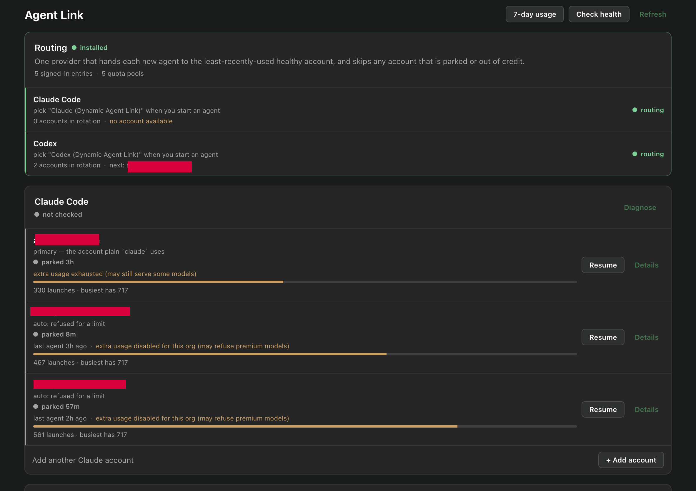
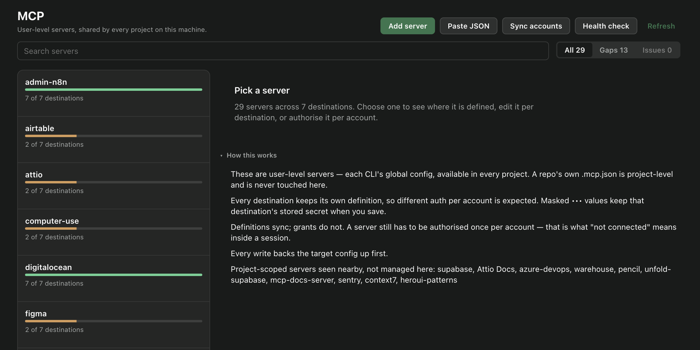
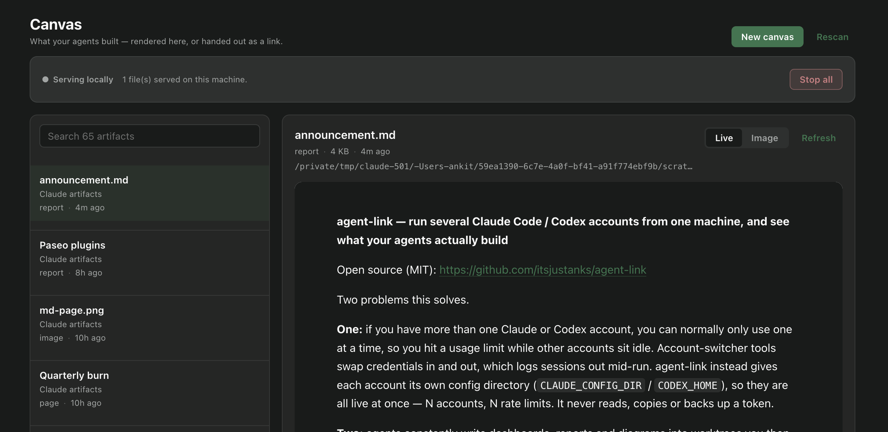

<div align="center">

# agent-link for Paseo

**Every AI coding account you own, every MCP server across them, and everything your agents build — in three tabs.**


[](LICENSE)


</div>

This is the Paseo app that ships with [agent-link](https://github.com/itsjustanks/agent-link). The CLI works perfectly well on its own; this is the same thing with a UI, plus a canvas viewer the CLI cannot give you.

Three sidebar tabs:



## 👥 Agent Link

One card per provider connector — **Claude Code, Codex, Kimi Code, Grok** — each with a health dot and Paseo's own diagnostic one click away. Inside each card, a table of every account under it:

- the **primary** account (the login your plain `claude` / `codex` uses), shown by email
- every **account slot** with live state: 🟢 logged in · 🟠 login needed · 🔴 wrong account (the slot folder says one email, the login inside is another)
- a **pool summary** — "5 logged-in entries → 4 independent quota pools" — and a ⚠ badge on any two entries signed into the *same* account, since a rate limit belongs to an account, not to a slot
- **7-day usage** — on request, reads each account's own transcripts and reports sessions, input/output tokens and which models that account actually ran. No costs and no quota percentages: neither CLI exposes remaining quota without the account's token, which this plugin never reads.
- **Credit state** — when an account has hit a spend limit, its row says so (Claude records the reason in its own config), instead of you finding out when an agent dies.
- **Rotation usage** — a bar and a count showing how many agents the router has handed each account and when it was last used, so you can see the rotation actually spreading. (This is launches routed by agent-link, not Anthropic/OpenAI quota: neither CLI exposes remaining quota per account without reading its token, which this plugin deliberately does not do. Paseo's own usage figure covers the primary accounts only.)
- **+ Add account** — creates the slot for a new account and hands you the one command to finish sign-in. The browser step itself stays in a terminal because both CLIs ask you to paste a code back; the row turns green once you have (and flags a mismatch if you signed in as someone else)
- **Auto-router** — one click wires a single `Claude (Dynamic Agent Link)` / `Codex (Dynamic Agent Link)` provider that sends each new agent to the least-recently-used live account. Pick that one provider and your accounts get used automatically; a running agent is never re-routed.
- **Park 3h / Resume** — take an account that hit its limit out of rotation and put it back
- **Wire into Paseo** — one click adds that account as a Paseo custom provider (`extends` the native integration, pointing `CLAUDE_CONFIG_DIR` / `CODEX_HOME` at the slot). Each wired account is an independent quota pool: five agents across three Claude accounts genuinely run on three separate rate limits. A banner reminds you Paseo loads new providers at the next daemon restart.



## 🔌 MCP

A universal manager for **user-level** MCP servers across every provider on the machine — Claude Code and Codex primaries (labeled with their actual account), every wired provider, every account slot, plus Kimi Code and Grok. One row per server, one column-equivalent per destination:

- **Sticky header** with search and **All / Gaps / Issues** tabs
- **Health check** — HTTP servers get a real request (a 401/403 is reported as **auth needed**, which is the honest answer to "does this need authorizing?"); stdio servers get a binary-on-PATH check. 🟢 / 🟠 / 🔴 per server.
- **Expand** a server for its destination table: present or missing per destination, add or remove there
- **Edit** — every destination's own definition, side by side. Different auth per account is expected and supported: change one account's header and save just that destination, or take one destination's version and **Use for ALL**.
- **Reveal secrets** — masked (`•••last4`) by default; one tap shows the stored values. Masked values are preserved on save, so editing one account can never copy its token into another. (Deliberate cross-account copies — **Add to all** and **Use for ALL** — do carry a definition's inline credentials, which is the point of those buttons.)
- **Rename everywhere** — rewrites a server's key across every config that has it (copy-then-delete, so a failure can never lose the definition)
- **Add server** — http or stdio, headers/env as `KEY=VALUE` lines, targeting all destinations or specific ones
- **Edit as JSON** — a `Fields | JSON` switch on every destination. You always type the shape people actually paste out of a README (Claude's), and TOML destinations are translated on the way in and out, so you never have to know that Codex spells headers `http_headers`. Validate before saving, Preview shows exactly what the destination will hold in its own format with any dropped keys named, and errors point at a line and column with a caret.
- **Paste JSON to import** — accepts `{"mcpServers":{…}}`, `{"servers":{…}}`, a single named entry, a bare definition, a `claude mcp add-json` command, or a TOML block; strips code fences, comments and trailing commas and tells you what it had to clean up. Unfilled placeholders like `<YOUR_TOKEN>` block the write until you say otherwise. Validation covers every server × destination pair before anything is written, so a bad import writes nothing at all rather than half of it.
- **Authorise from the panel** — OAuth servers are authorised once per account, and this runs `claude mcp login` / `codex mcp login` under the right account for you, shows the URL to open, and watches for it to finish. Sign out is there too. (The callback lands on the daemon machine's localhost, so when Paseo's daemon is somewhere else the panel hands you the command instead of pretending.)
- **Sync accounts** — pushes user-level definitions and project trust from each primary into its account slots

Every write backs up the target config first (last 20 kept — one "apply to all" is seven files in one press), replaces it atomically, and keeps the permissions it had, because these files hold bearer tokens. A config that exists but cannot be parsed is never overwritten. An edit is **lossless**: the stored entry is loaded and only the fields you changed are modified, so keys the plugin does not model — Claude's `type`, Codex's `enabled` and `startup_timeout_sec` — survive it.



## 🖼 Canvas

Agents write HTML, Markdown, SVG and images — dashboards, reports, diagrams — into worktrees you would otherwise have to go and find in a terminal. This tab finds them and **renders them inside Paseo**.

- **Live or picture, and live is the default on desktop.** Paseo's `react-native` on desktop and in the browser *is* react-native-web, whose `unstable_createElement` builds a real DOM node — the same mechanism Paseo uses for its own HTML file previews and its mermaid runtime. So a canvas renders as an actual interactive page inside the panel: filters work, charts respond, and the frame reloads itself when the agent rewrites the file. It runs sandboxed (`allow-scripts`, no `allow-same-origin`), so the page cannot reach back into Paseo. On iOS and Android that export does not exist, so the picture below is what you get there — and it is one tap away everywhere.
- **The picture path renders in the app too, not in a browser.** A Paseo surface is React Native, so there is no WebView to put a page in. The artifact is rasterised on the daemon with headless Chrome over the DevTools protocol — full page height, not a viewport crop — and the picture is what you see in the panel. That is also the only thing that works when **the daemon is a server somewhere else**: opening a browser on that machine would show the page to nobody. Renders are ~0.5s warm, WebP, and cached against the file's own mtime, so reopening one is instant.
- **Four kinds, one path.** HTML renders as authored. Markdown becomes a typeset report — headings, tables, task lists, code blocks — drawn in *your* Paseo theme, so a report matches the app around it. SVG and images are framed the same way. Markdown matters because an agent asked for a report writes `.md` far more often than a styled page.
- **Where it looks** — every workspace's top level, the folders agents actually write to (`artifacts/`, `reports/`, `dashboards/`, `canvas/`), your own `~/Artifacts`, `~/Diagrams`, `~/Canvas`, and **Claude Code's own session scratchpads**, which is where the Artifact tool leaves a page before it is published anywhere.
- **New canvas** — describe a dashboard and an agent builds it. It is dispatched into the workspace you pick, through your rotating provider, with the brief that decides whether the result renders at all: one self-contained file, no CDN, a real `<title>`. When the agent has written it, it appears in the list.
- **It opens on what you were last looking at**, refreshes itself while an agent rewrites the file, and never sends you to a browser to see a canvas. The two actions that matter are in front: put it in the conversation, or get a link. Launching a real browser is a fallback for interactive pages, tucked at the bottom, and it says plainly that it runs on the Paseo host — which is only your machine when the daemon is local.
- **Send it into the chat** — open Canvas *beside an agent* (⌘K → "Canvas for this agent", or the workspace tab) and the panel scopes itself to that workspace and gains **Send to chat**: the render is posted into the conversation as an image, so the agent can see what it drew and you can talk about it in place. From the sidebar the same button appears for any live agent working in that artifact's folder.
- **Share** — a [Cloudflare quick tunnel](https://developers.cloudflare.com/cloudflare-one/connections/connect-networks/do-more-with-tunnels/trycloudflare/) for when someone needs the live, interactive page instead of a picture of it. The page is read from disk on every request, so a shared link keeps showing the current file — unlike an uploaded snapshot, which is frozen the moment it is published. A Markdown artifact is turned into a page at request time too.
- **Missing dependency, not a dead button.** Rendering needs Chrome or Chromium (a `chrome-headless-shell` from a Playwright or Puppeteer cache is preferred when present, and is faster); sharing needs `cloudflared`. Without either, the tab names the one command that fixes it and everything else keeps working.

A shared link is **live, not a snapshot**: Cursor's published canvas is an upload frozen at publish time, while this is read from disk per request, so the page keeps changing as the agent rewrites the file. The trade is durability — the link lasts as long as Paseo is running, and a new one is issued next time.

A shared link is **public while it is up** — the URL carries an unguessable token, only the artifact's own folder is reachable, path traversal out of it is refused, nothing is writable, and the tunnel dies with the plugin.

The link is held back until it actually resolves. cloudflared prints the hostname before DNS carries it, and a lookup made in that window is cached as a failure by the machine that made it — so the tab shows "opening" for a few seconds rather than handing you a link that appears broken.

### About Claude artifacts

Claude Code's Artifact tool writes a real file to disk and then publishes it to `claude.ai`. The **local file** is what this tab shows — including the ones sitting in session scratchpads that nothing else surfaces. The published copy lives behind a login and has no local registry, so no panel can list or update it; anything claiming otherwise would be guessing.

### Built for narrow screens

Paseo plugins run on phones as well as desktop, so the panel uses one spacing scale that tightens on narrow layouts, buttons with real touch targets, account rows that put the identity on its own line above the detail, and an MCP destination table that stacks instead of squeezing labels to nothing.

## Install

**With the CLI** — one command:

```sh
agent-link app install paseo
```

It copies the plugin into `<paseo home>/plugins/agent-link`, installs its dependencies, typechecks it, registers it under the id `agent-link`, and confirms the daemon has it running. Re-run it to upgrade; `agent-link app remove paseo` uninstalls; `agent-link update` updates the CLI and this panel together. If Paseo, Node or the plugins switch is missing, it says which and stops rather than half-installing.

**From the Paseo UI** — no CLI needed:

```sh
git clone https://github.com/itsjustanks/agent-link
```

1. **Settings → Plugins**
2. Turn on **Enable plugins** — the global switch for every configured plugin
3. Paste the absolute path to `agent-link/apps/paseo` into **Plugin directory**
4. Leave **Plugin installation ID** blank; `paseo-plugin.json` supplies `agent-link`
5. Press **Install directory**

No `npm install` step: the plugin imports only modules Paseo provides at runtime, and Paseo compiles it on install. The same screen has **Reload**, **Disable**, **Remove** and **Logs** per plugin — Logs is the first place to look if a tab misbehaves. Removing a plugin deletes its configuration, never your source directory.

**Working on it?** `agent-link app install paseo --link` registers your checkout in place instead of copying, so `paseo plugin reload agent-link` picks up an edit.

Requires Paseo ≥ 0.5 with plugins enabled. Tested against 0.5.0-beta.5. Sharing a canvas additionally needs `cloudflared`; nothing else in the plugin does.

**Nothing else is required.** Every provider and account it finds is one you already have — the plugin installs no software and creates no accounts. Providers you don't use simply don't appear.

### Optional: the agent-link CLI

[**agent-link**](https://github.com/itsjustanks/agent-link) is the companion CLI that creates and logs in account slots (`agent-link add claude you@work.com`) and can hot-switch which account the plain `claude` / `codex` command uses. The plugin is fully standalone without it — it reads whatever slots exist and does its own MCP sync — but with agent-link installed, logins become one command and the panel points you at it. The panel also reads hand-rolled slot layouts in `~/.claude-accounts` / `~/.codex-accounts`.

### Authentication by account

MCP *definitions* sync between accounts; MCP *grants* do not — a server is authorized once per account, which is what "server X is not connected" actually means. The MCP tab lists every account with how many servers it defines and which still need signing in, plus the exact command:

```sh
CLAUDE_CONFIG_DIR="~/.agent-link/accounts/claude/you@work.com" claude mcp login <server>
```

Project-scoped servers (defined in a repo's `.mcp.json`) are listed too, since they also need authorizing per account even though this plugin never edits them.

### Scope: user-level, not project-level

The MCP tab manages **user-level** (global) servers — each provider's own config, available in all your projects. A repo's own project-level servers (`.mcp.json` in the repository) belong to that repo and are never read or written.

## About rate limits and failover

Paseo has no automatic provider failover: an agent that hits a usage limit stops with an error and keeps its workspace — it does not move itself to another account. Three things reduce the pain, and the tab exposes all of them:

- **7-day usage** — on request, reads each account's own transcripts and reports sessions, input/output tokens and which models that account actually ran. No costs and no quota percentages: neither CLI exposes remaining quota without the account's token, which this plugin never reads.
- **Credit state** — when an account has hit a spend limit, its row says so (Claude records the reason in its own config), instead of you finding out when an agent dies.
- **Rotation usage** — a bar and a count showing how many agents the router has handed each account and when it was last used, so you can see the rotation actually spreading. (This is launches routed by agent-link, not Anthropic/OpenAI quota: neither CLI exposes remaining quota per account without reading its token, which this plugin deliberately does not do. Paseo's own usage figure covers the primary accounts only.)
- **+ Add account** — creates the slot for a new account and hands you the one command to finish sign-in. The browser step itself stays in a terminal because both CLIs ask you to paste a code back; the row turns green once you have (and flags a mismatch if you signed in as someone else)
- **Auto-router** — one provider that picks a live account per launch, so agents spread across accounts without you choosing
- **Park / Resume** — take an exhausted account out of rotation; new agents skip it until it recovers
- **Pool count** — see how many *independent* limits you actually have, with duplicates flagged

A running agent still keeps the account it started on; nothing re-routes mid-task (that is what breaks sessions).

Paseo's built-in usage figure reads the primary accounts only (`~/.claude`, `~/.codex`); it does not see per-account slots. Per-pool usage percentages would require reading each account's access token, which this plugin deliberately does not do.

## What stays in the terminal

Per-server MCP authorization, and finishing an account sign-in in the browser. The panel can *start* an account login for you (**+ Add account**), but the sign-in itself happens in the browser, and MCP OAuth Those flows are owned by each CLI and are **provider-specific and per-account**: Claude Code authorizes an MCP server with `/mcp` inside a session on that account; other CLIs have their own flow. No panel can do them for you. What this panel does is show exactly which account or server needs authorizing, and hand you the command.

## Troubleshooting

- **Buttons stop responding after a plugin update/reload** — an already-open panel keeps the old client bundle with a dead session. Navigate to another sidebar item and back (or reopen the Paseo window).
- **A wired provider errors about a path that doesn't exist** — Paseo builds its provider registry at daemon startup; config changes only take effect after `paseo restart`. Restart when no agents are mid-task.
- **A slot shows "login needed" although Paseo lists the provider** — listed means *configured*, not *authenticated*. Run the login command the panel shows.
- **An edit disappeared** — a running CLI session can rewrite its own config from memory. Make config changes when that provider isn't mid-session, or re-apply after.

## Security

Plugin backend code runs trusted and unsandboxed on your daemon machine (that is true of every Paseo plugin). Specifically, this one:

- reads MCP config files and, from credential-adjacent files, **only** the account email used for identity checks — never token material
- masks secret values in the UI by default; full values are shown only when you press **Reveal secrets**, and never leave your machine
- strips URL query strings from displayed summaries (some providers put tokens in URLs)
- backs up every config file before writing it, and refuses to overwrite a file it cannot parse
- changes Paseo providers through Paseo's own `config.patch` API, never by editing the daemon config file
- copies MCP *definitions* between accounts, never credentials — OAuth grants stay in each account's own store
- serves a canvas read-only, from that file's own folder, behind a random token, and only while you have it shared — a public tunnel exists only after you press Share, and dies with the plugin

## License

MIT
